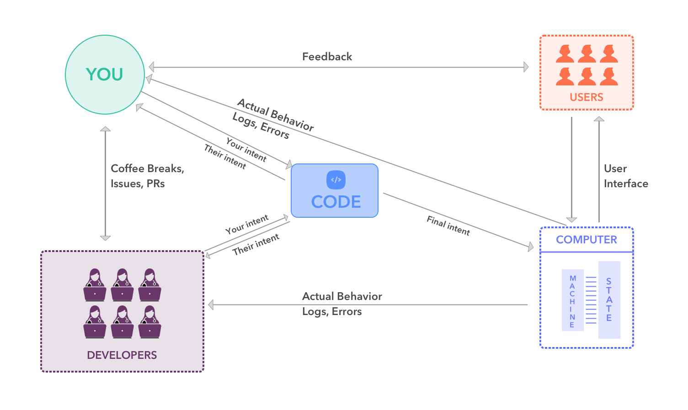

> don't know exactly what would go in this chapter yet, there's a lot of ways to approach this. what's in this readme is just notes pulled from the past as a starting point

# What is Programming?

- [What is Programming?](#what-is-programming)
  - [Programming is Communication](#programming-is-communication)
  - [Source Code is the Text](#source-code-is-the-text)
  - [End Users](#end-users)
  - [Other Developers](#other-developers)
  - [The Computer](#the-computer)
  - [Your Community](#your-community)
- [What is JavaScript?](#what-is-javascript)
  - [Programming languages?](#programming-languages)
  - [JavaScript ...](#javascript-)
  - [Further Study](#further-study)
- [Writing Meaningful Code](#writing-meaningful-code)
  - [Before Writing Your Code](#before-writing-your-code)
  - [Before Running Your Code (1)](#before-running-your-code-1)
  - [Before Running Your Code (2)](#before-running-your-code-2)
  - [Try Running Your Code](#try-running-your-code)
  - [Keep Testing Your Code!](#keep-testing-your-code)
  - [Finally it Works!](#finally-it-works)

---

## What is Programming?

It's a never-ending conversation.

### Programming is Communication

It's a continuous conversation between:

- You and end users
- You and other developers
- You and the computer
- You and your community

### Source Code is the Text

The code you write is the center of this conversation.

The same code needs to say different things,
to different audiences,
at the same time!

### End Users

- Why should I use this?
- How do I use it?
- What does it do for me?
- What does it do for others?

### Other Developers

- What is this code supposed to do?
- What does it actually do?
- How is it supposed to work?
- Does it actually work?
- How can I run it?
- How can I contribute to it?

### The Computer

- Can it understand these instructions?
- Does it throw any errors?
- What is the next instruction?
- What changes in memory at this step?

`PS. the computer is always right.`

### Your Community

- What role does this project play?
- How does it fit in?
- How can this project help?
- How could it cause problems?

---

## What is JavaScript?

It's a programming language, but what's that?.

### Programming languages?

.. are actually software!

1.  They interpret the code you write
2.  Convert it to instructions for the computer
3.  Follow the instructions
4.  Then help you understand what happened

### JavaScript ...

- Is the language of the web
- Adds interactivity to web pages
- Can do soo much than expected
- Will take a lot of work to understand
- Will become your best frienemy

### Further Study

- [Andrew Mosh](https://www.youtube.com/watch?v=upDLs1sn7g4)
- [Code School](https://www.youtube.com/watch?v=nItSSTwBvSU)
- [MDN: First Steps](https://developer.mozilla.org/en-US/docs/Learn/JavaScript/First_steps/What_is_JavaScript)
- [MDN: JS Basics](https://developer.mozilla.org/en-US/docs/Learn/Getting_started_with_the_web/JavaScript_basics)
- [javascript.info](https://javascript.info/intro)

---

## Writing Meaningful Code

Code first for people, then for computers.

### Before Writing Your Code

What will you build? Why build it?

- What should your end project do?
- How will you know if it does?
- Who is this end project for?
- Write out your user stories!

### Before Running Your Code (1)

Can you understand it?

- Are there any extra lines of code?
- Is there any repeated code?
- Can you explain it out loud?
- Can you step through line by line?
- Are your tests easy to understand?

### Before Running Your Code (2)

Can others understand it?

- Did you follow a style guide?
- Are your variables well-named?
- Do your tests help explain your code?
- Did you use a linter? Formatter? Spell-Checker?

### Try Running Your Code

Does the computer understand it?

- What errors are logged?
- Where did the errors occur in your code?
- What kind of errors are they?
- Are your relative paths correct?
- Did you mis-spell anything?

### Keep Testing Your Code!

Does it do what you expected?

- What errors were logged?
- Where were they, and what are they?
- How can you fix them?
- What did your project actually do?
- Is that what you expected?
- Do your tests pass?
- Which tests failed, what does that show you?

### Finally it Works!

Compare the end result to your initial plan

- Does it satisfy your user story?
- Do you want to change your initial goal?
- Do you need to change the project?
- Are you tired and ready for some sun shine?
